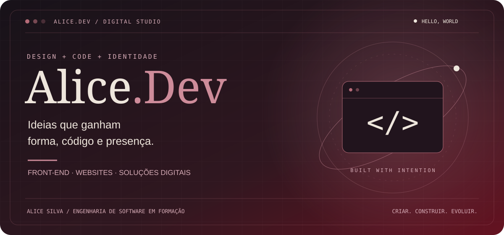
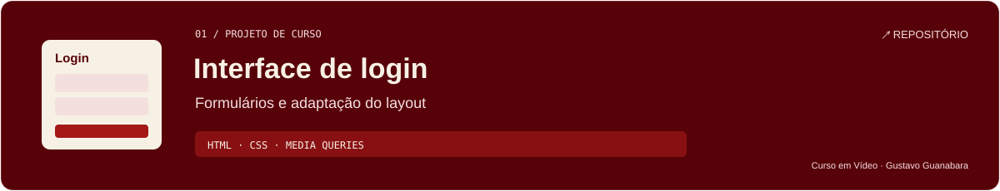
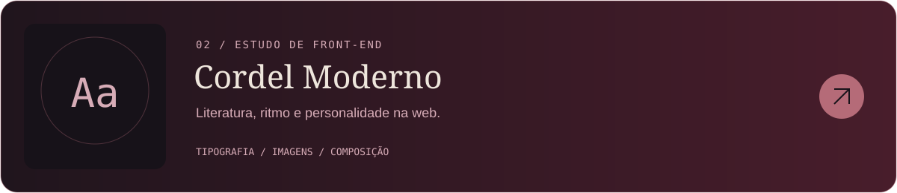
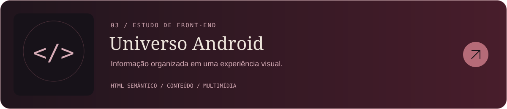

<div align="center">




[](https://www.instagram.com/alicesilva.dev/)


**[Minha trajetória](#sobre-mim) &nbsp; / &nbsp; [Projetos](#projetos-em-destaque) &nbsp; / &nbsp; [Vamos criar](#vamos-conectar)**

</div>

---
## Sobre mim

Olá! Sou a **Alice Silva**, desenvolvedora web e graduanda em **Engenharia de Software**. Estou construindo minha trajetória conectando desenvolvimento, criatividade e a criação de sites e soluções digitais.

Minha marca, **Alice.Dev**, conecta criatividade e tecnologia na criação de websites, landing pages e e-commerce. Também sou membra da equipe de desenvolvimento web front-end da **JW Soluções Digitais**.

Aqui compartilho projetos de estudo e a evolução da minha prática. Os projetos que desenvolvi em um curso fazem parte dessa base: cada um é uma oportunidade de aplicar conceitos, entender decisões e melhorar minhas soluções.

> **Meu foco:** transformar ideias em experiências digitais que comuniquem a identidade de cada negócio.

## Sites e soluções digitais


[Conversar sobre um projeto](#vamos-conectar)

## Tecnologias e ferramentas

**Base aplicada nos meus projetos de estudo**


**Trilha de aprendizado**


**Onde compartilho minha evolução**


**Ferramentas que utilizo**

| Área | Ferramentas |
| --- | --- |
| Criação e interfaces | WordPress · Figma · Lovable · GIMP |
| Desenvolvimento e ambiente | VS Code · Android Studio · Docker · FileZilla |
| Apoio com IA | Claude · ChatGPT · Antigravity |
| Colaboração | Discord |

## Projetos em destaque

Os projetos abaixo fazem parte da minha trajetória de estudo em desenvolvimento web. São estudos do curso **HTML5 e CSS3**, de **Gustavo Guanabara — Curso em Vídeo**, apresentados com seu contexto de aprendizado.

[](https://github.com/alicesilvadr/projeto-login)

**Projeto de estudo · HTML e CSS**

Interface com campos de e-mail e senha, ícones e folhas de estilo para adaptação do layout a diferentes telas.

**Conceitos presentes:** formulários HTML, organização visual e media queries.  
**Conexão com meu foco:** construir interfaces claras para experiências digitais.

[↗ Explorar código](https://github.com/alicesilvadr/projeto-login)

---

[](https://github.com/alicesilvadr/projeto-cordel)

**Projeto de curso · HTML e CSS**

Página dedicada ao cordel de Milton Duarte, combinando poesia, tipografia e seções com imagens de fundo.

**Conceitos presentes:** composição visual, fontes web e efeito de fundo fixo.  
**Conexão com meu foco:** usar o desenvolvimento web para apresentar conteúdo com personalidade.

[↗ Explorar código](https://github.com/alicesilvadr/projeto-cordel)

---

[](https://github.com/alicesilvadr/projeto-android)

**Projeto de curso · HTML e CSS**

Página de conteúdo sobre a história do mascote Android, com artigo, imagens adaptativas e vídeo incorporado.

**Conceitos presentes:** estrutura semântica, elementos multimídia e apresentação de conteúdo.  
**Conexão com meu foco:** organizar informações em páginas que comuniquem com clareza.

[↗ Explorar código](https://github.com/alicesilvadr/projeto-android)

**Mais da minha jornada:** [HTML e CSS](https://github.com/alicesilvadr/html-css) · [Trilha de JavaScript](https://github.com/alicesilvadr/javascript) · [Projeto social](https://github.com/alicesilvadr/Projeto-social) · [Projeto de portfólio do curso](https://github.com/alicesilvadr/projeto-portifolio)
## Meu próximo capítulo

<!-- Proposta de objetivos: ajuste para refletir seus planos reais. -->

```text
alice@digital-studio:~$ roadmap

[em andamento] Graduação em Engenharia de Software
[próximo passo] Documentar os aprendizados dos projetos
[próximo passo] Evoluir meu portfólio de desenvolvimento web
[próximo passo] Aprofundar acessibilidade e responsividade
[direção]       Criar sites e soluções com identidade

> Aprender. Construir. Refinar.
```

<details open>
<summary><strong>Painel de atividade</strong></summary>

## Atividade no GitHub

<!-- Indicadores de serviços externos; disponibilidade sujeita aos provedores. -->

<div align="center">


<sub>As linguagens refletem o código dos repositórios analisados pelo serviço.</sub>


</div>

<details>
<summary>Conquistas na plataforma</summary>


</details>

</details>

<!-- SNAKE: remova este comentário externo após a primeira execução do workflow.
## Cada contribuição faz parte da jornada


<picture>
  <source media="(prefers-color-scheme: dark)" srcset="https://raw.githubusercontent.com/alicesilvadr/alicesilvadr/output/github-contribution-grid-snake-dark.svg" />
  <source media="(prefers-color-scheme: light)" srcset="https://raw.githubusercontent.com/alicesilvadr/alicesilvadr/output/github-contribution-grid-snake.svg" />
  
</picture>
-->

## Vamos conectar

### Sua próxima ideia pode começar aqui.

Uma landing page, um website ou uma loja virtual: vamos conversar sobre a presença digital da sua marca.

[](https://github.com/alicesilvadr)

[](https://www.instagram.com/alicesilva.dev/)

**Contato para orçamento:** [+55 (48) 99938-8729](tel:+5548999388729)

<!-- Caso confirme que o número tem WhatsApp, pode usar: https://wa.me/5548999388729 -->
---

<div align="center">

**Alice.Dev**  
<sub>Criatividade na essência. Tecnologia na construção.</sub>

`< / >` · `made with intention`

</div>


